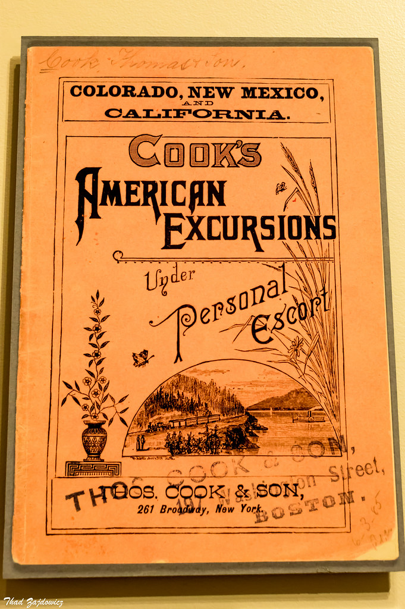

## Blur Detection

Creates a CSV (image_blur_report.csv) of all images in a folder, and their respective [brisque](https://learnopencv.com/image-quality-assessment-brisque/) and [laplace blur detection](https://www.pyimagesearch.com/2015/09/07/blur-detection-with-opencv/) scores.  

 ### Usage:
> python image_blur_atom.py images

### Results:  

File | Brisque | Laplace
------------ | ------------- | -------------
images/cc0_image_blurry.jpg | 39.803663276689434 | 141.53863914748337
images/cc0_image_clear.jpg | 19.27929491549841 | 2992.3613823694723

### Blurry Image:
  

### Clearer Image:

### Notes:  

According to [Adrian Rosebrock](https://www.pyimagesearch.com/2015/09/07/blur-detection-with-opencv/) a higher laplace score (over 200) is a clearer image.  

 According to [Kushashwa Ravi Shrimali](https://learnopencv.com/image-quality-assessment-brisque/) a lower brisque score is a clearer image.
